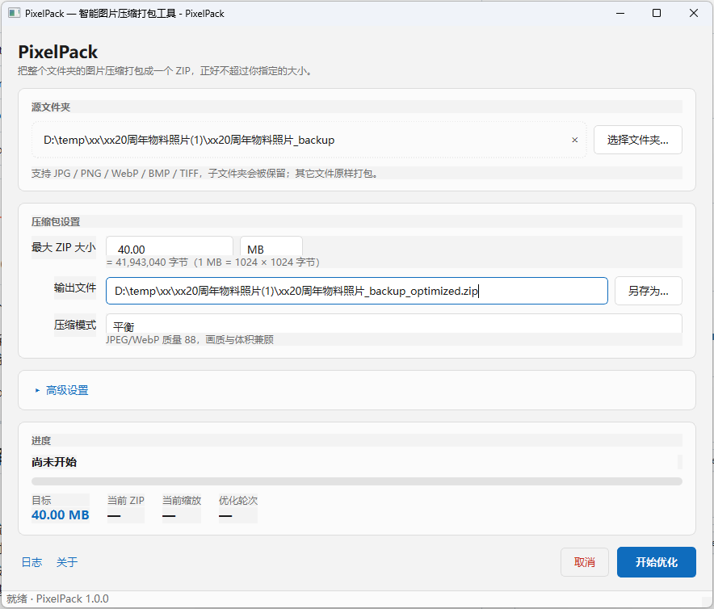

<p align="center">
  
</p>

# PixelPack — 智能图片压缩打包工具

把一个文件夹里的图片，压进一个**指定大小**的 ZIP 里。

你告诉它「不超过 20 MB」，它还给你一个不超过 20 MB 的压缩包——在满足这个前提的
条件下，尽可能保留分辨率和画质。

Windows 10 / 11 桌面程序，完全离线运行，不联网、不上传任何图片。

---

## 界面

<p align="center">
  
</p>

---

## 它解决什么问题

微信、邮件、网盘、各种报名系统都有附件大小限制。手工压缩的麻烦在于：

- 统一缩放（比如全部缩到 50%）——有的图缩过头了，有的还太大，来回试很费时间；
- 按 JPEG 质量去压——质量调到 60 还是 95，体积差多少全凭感觉，而且对 PNG 基本无效。

PixelPack 反过来做：**它真的把 ZIP 生成出来，量一下多大**，然后根据量出来的结果
调整，反复逼近，直到刚好塞进限制里。

---

## 核心特性

| | |
|---|---|
| **真的量，不是估算** | 每一轮都重新渲染图片、生成真实的 ZIP、读磁盘上的字节数。不靠公式猜。 |
| **不超限是硬约束** | 比如要求不大于20M ，那么19.85 MB 合格，20.01 MB 不合格。最终产物永远 ≤ 目标。 |
| **分辨率优先** | 体积主要由尺寸决定，而不是把 JPEG 质量压到 40。质量只在大范围内取合理值（92 / 88 / 82）。 |
| **不放大、不毁小图** | 最大缩放 100%，绝不放大。长边不超过设定下限（默认 800 px）的图片不再缩小。 |
| **不动原图** | 所有处理在 `%TEMP%\PixelPack\<uuid>\` 里进行，成功后清理。源文件夹只读。 |
| **保留目录结构** | 支持多级子目录、中文名、空格、各种特殊字符，ZIP 内的层级和原来一致。 |
| **非图片文件原样打包** | PDF / TXT / DOCX 等原样复制进 ZIP，并计入大小限制。 |
| **不卡界面** | 优化跑在后台线程，界面实时显示阶段、轮次、当前 ZIP 大小，随时可取消。 |

支持的图片格式：**JPG / JPEG / PNG / WebP / BMP / TIFF**。

PNG 仍然是 PNG（不会偷偷转成 JPEG），透明通道保留，EXIF 方向自动纠正。

---

## 环境要求

- Windows 10 / 11（ linux 可以迁移但未做 ）
- Python 3.12 或更高（打包后的 `PixelPack.exe` 不需要装 Python）

## 源码安装

```powershell
git clone <repo> pixelpack
cd pixelpack
python -m venv .venv
.venv\Scripts\python.exe -m pip install -e ".[dev]"
```

## 运行

```powershell
.venv\Scripts\python.exe -m pixelpack
```

也可以直接带上源文件夹：

```powershell
.venv\Scripts\python.exe -m pixelpack "D:\照片\2025 假期"
```

---

## 使用说明

1. **选择文件夹**——点「浏览」选一个文件夹，或者直接把文件夹拖进窗口。
2. **设置上限**——填数字，右边选 MB 或 GB（1 MB = 1024 × 1024 字节）。
3. **选择模式**——画质优先（质量 92）/ 平衡（质量 88，默认）/ 体积优先（质量 82）。
4. **高级设置**（可选）——是否包含子文件夹、是否保留 EXIF、最小图片长边、优化精度。
5. 点**开始优化**。

输出文件默认放在源文件夹旁边，名字是 `原文件夹名_optimized.zip`，也可以自己改。

运行过程中会依次看到：`正在扫描图片` → `正在测试图片尺寸` → `正在生成 ZIP` →
`正在精调` → `正在完成`，同时显示目标大小、当前 ZIP 大小、当前缩放比例和已用轮次。

结束后弹出结果窗口，列出每张图片的**文件名 / 原尺寸 / 最终尺寸 / 原大小 / 最终大小 /
缩放比例**（点表头可排序），以及总的压缩比例和 ZIP 空间利用率。

主窗口右上角的**「关于」**按钮会打开关于窗口：Logo、版本号、开发者与联系方式。
Email 可以直接点开默认邮件客户端，QQ / WeChat 点一下即复制到剪贴板。

---

## 它是怎么做到的

一句话：**用二分法找一个全局缩放比例，每一轮都真的生成一次 ZIP 来量。**

### 1. 先看原图能不能直接塞进去

如果整个文件夹原样打包就已经小于目标，那就原样打包，一张图都不重新编码。
这是最快的路径，也是画质最好的路径。

### 2. 估算一个起点

用 `sqrt(目标图片预算 / 当前图片总大小)` 估一个初始缩放比例。这只是起点，
后面全靠实测修正。

### 3. 在「一定塞得下」和「一定塞不下」之间二分

- 已知可行比例 `lo`，已知不可行比例 `hi`；
- 每轮取中点，**从原始图片重新渲染**，生成真实 ZIP，量实际大小；
- 塞得下就把 `lo` 抬上去，塞不下就把 `hi` 压下来。

两个关键点：

- **每一轮都从原图重新渲染。** 不是 `原图 → 80% → 64% → 51%` 这样一路缩下去，
  而是 `原图 → 80%`、`原图 → 64%`、`原图 → 51%`。链式缩放会累积重采样损失，
  同样的缩放比例下画质明显更差。
- **始终保留 `best_safe_candidate`。** 不管搜索过程怎么走，手里永远攥着一个
  已经实测确认塞得下的方案。哪怕中途出错或者被取消，也不会交出一个超限的结果。

### 4. 精调，把剩下的空间用掉

二分结束后，ZIP 可能只有目标的 92%，那 8% 就浪费了。精调阶段会挑选一部分图片，
单独把它们的缩放比例提高 1~3%，重新实测：

- 优先挑**原图大**的、**压缩后省空间**的、**每字节换到像素最多**的；
- 每次调整后重新生成 ZIP 实测，**一旦超限立刻回滚**；
- 反复进行，直到用掉 98%~99.5% 的空间，或者没有图片还能再放大为止。

### 5. 什么时候算「做不到」

如果**非图片文件本身就已经超过目标**（比如文件夹里有个 30 MB 的视频，目标是
20 MB），那不是压缩能解决的问题，程序会直接告诉你：

> 无法达到目标压缩包大小，不可优化文件已经超过大小限制。

### 性能上的取舍

二分法要跑几十轮完整的渲染 + 打包，所以：

- 解码后的原图放在有上限的 LRU 缓存里，不重复解码；
- 渲染结果按 `(路径, 宽, 高, 质量, 格式)` 缓存——被小图保护规则「钉住」的图片
  每轮渲染结果都一样，直接命中缓存；
- 并发度限制在 `min(4, CPU 核数)`；
- **不会把所有原图一次性读进内存**，ZIP 也是边生成边写盘。

正确性优先，其次才是速度。

---

## 安全保证

这些是硬性约束，不是「尽力而为」：

- **绝不修改原图。** 所有处理都在临时目录 `%TEMP%\PixelPack\<uuid>\` 中进行，
  源文件夹始终只读。
- **输出前必须验证。** ZIP 要能正常打开、所有文件都在、`ZipFile.testzip()` 无错误、
  实际大小不超过目标——四项全过才算成功。
- **原子写入。** 先写 `<输出名>.part`，全部验证通过后再 `os.replace` 成正式文件。
  中途失败或者被取消，不会留下一个半截的、打不开的 ZIP。
- **取消后干净退出。** 删除临时文件、不动源文件、不留损坏的 ZIP。

---

## 项目结构

```
pixelpack/
├─ src/pixelpack/
│  ├─ app.py                     程序入口、命令行参数
│  ├─ assets/
│  │  └─ logo.png                关于窗口的 Logo，随包分发
│  ├─ ui/
│  │  ├─ main_window.py          主窗口
│  │  ├─ about_dialog.py         关于窗口
│  │  ├─ result_dialog.py        结果表格窗口
│  │  └─ style.py                主题与样式表（浅色 / 深色）
│  ├─ core/
│  │  ├─ scanner.py              扫描目录、识别图片、读取尺寸
│  │  ├─ image_processor.py      读取、缩放、编码
│  │  ├─ archive.py              生成 ZIP、量实际大小、校验
│  │  ├─ optimizer.py            二分搜索、目标判定、不可达检测
│  │  ├─ refinement.py           用掉剩余空间、单图微调
│  │  └─ cache.py                解码 / 渲染结果缓存
│  ├─ models/                    数据模型（图片信息、设置、结果）
│  ├─ workers/                   后台线程封装
│  └─ utils/                     大小格式化、临时目录、日志、打包资源定位
├─ tests/                        pytest 测试
├─ images/                       README 用的图片（Logo、界面截图）
├─ assets/
│  ├─ pixelpack.ico              可执行文件图标（打包时生成）
│  └─ version_info.txt           Windows 版本信息（打包时生成，勿手改）
├─ scripts/
│  ├─ build_windows.ps1          打包成 PixelPack.exe
│  ├─ entry_point.py             冻结版本的入口
│  ├─ make_icon.py               按代码生成图标
│  ├─ make_version_info.py       由包内常量生成 Windows 版本信息
│  ├─ render_about_preview.py    离屏渲染关于窗口，检查排版
│  ├─ acceptance_run.py          真实文件夹 + 真实上限的验收测试
│  └─ gui_smoke.py               手动界面冒烟检查
└─ pyproject.toml
```

**界面和算法是分开的。** `core/` 里的模块不知道 PySide6 的存在，可以脱离界面
单独调用和测试。

---

## 测试

```powershell
.venv\Scripts\python.exe -m pytest
```

覆盖的范围包括：中文文件名、多级子目录、JPG / PNG / WebP / 透明图片、EXIF 旋转、
不放大、小图保护、原图本来就够小、需要压缩、目标不可达、非图片文件、ZIP 完整性，
以及界面层的表单校验、拖放、后台线程和取消。

其中最重要的一条断言是：**最终 ZIP 实际大小 ≤ 目标大小**。

---

## 验收测试

`scripts/acceptance_run.py` 会现场生成一批真实图片（JPG / PNG / WebP、多级子目录、
中文名、透明图、外加 txt 和 pdf），跑一次完整的优化，然后像人一样检查结果：

```powershell
.venv\Scripts\python.exe scripts\acceptance_run.py --target 10
```

它会逐项检查：ZIP 能打开、`testzip()` 无错误、文件数量对、目录结构对、非图片文件
逐字节一致、每张图都能解码且格式正确、没有被放大、小图保护生效、PNG 还是 PNG、
透明通道还在、源文件夹没被动过、没有残留 `.part` 文件。

加 `--keep` 可以保留生成的文件自己看。

### 一次真实的运行结果

8 张图片（2400×1800 到 1200×900，JPG / PNG / WebP，含透明图，分布在多级中文
子目录里），外加一个 txt 和一个 pdf，目标是 10 MB：

```
原始大小        31.10 MB
最终 ZIP 大小   10.00 MB
目标大小        10.00 MB
压缩比例        32.15%
ZIP 空间利用率  99.98%
优化轮次        15
耗时            14.3 秒
```

目标 10 MB，最终 10.00 MB——用掉了 99.98% 的空间，同时每一张图都还有
1200~1700 px 的长边（缩放比例约 69%），而不是被压成缩略图。

16 项检查全部通过。

---

## 打包成 PixelPack.exe

```powershell
powershell -ExecutionPolicy Bypass -File scripts\build_windows.ps1 -Clean
```

产物在 `dist\PixelPack\`，双击 `PixelPack.exe` 即可运行，**目标机器不需要安装
Python**。

可选的开关：

| 开关 | 作用 |
|---|---|
| `-Clean` | 打包前先删除 `build\` 和 `dist\` |
| `-Zip` | 额外生成 `dist\PixelPack-1.0.0-win64.zip`，方便分发 |
| `-Console` | 保留控制台窗口，用于排查启动失败的问题 |

采用**目录模式**而不是单文件模式：单文件版每次启动都要先把自己解压到 `%TEMP%`，
对 Qt 程序来说很慢，而且这种行为容易被杀毒软件盯上。

脚本在打包完成后会自动做两轮启动自检（离屏平台 + 本机平台），确认生成的可执行
文件真的能把界面构建出来——导入成功不等于界面能建起来，缺少 Qt 插件时只有真的
创建窗口才会暴露。

分发时把整个 `dist\PixelPack` 文件夹复制给对方即可。

### 版本号与关于窗口

版本号只有一个出处：`src/pixelpack/__init__.py` 里的 `VERSION`。其余两处都是
**读**它，而不是各自写一份：

| 用在哪里 | 怎么拿到的 |
|---|---|
| 关于窗口显示的版本 | `from .. import __version__`，界面代码里没有版本字面量 |
| Python 包元数据 | `pyproject.toml` 用 `dynamic = ["version"]` + `attr = "pixelpack.VERSION"` |
| 可执行文件的属性页 | 打包时 `make_version_info.py` 由同一批常量生成 `version_info.txt` |

因此「EXE 属性里显示的版本」和「关于窗口里显示的版本」不可能对不上——它们是同
一个字符串。打包脚本在生成 EXE 之后会把版本信息**读回来**校验，不匹配就直接报错，
而不是信任交给 PyInstaller 的那份文件。

关于窗口的 Logo 放在 `src/pixelpack/assets/logo.png`，属于包内资源：源码运行时按
`__file__` 找到它，打包后 PyInstaller 把包目录原样复制进 `_internal`，同一个相对
路径依然成立，所以不需要额外的路径配置，也没有外部文件要跟 EXE 一起发。

`tests/test_about.py` 会断言界面源码里不出现版本字面量，并解析 `version_info.txt`
核对公司名与版权信息，防止两边悄悄漂移。

想看一眼关于窗口的实际排版：

```powershell
.venv\Scripts\python.exe scripts\render_about_preview.py
```

它会离屏渲染、逐个子控件报告坐标和尺寸、把 PNG 存到 `build\`，并统计 Logo 区域的
颜色数——全是同一个颜色就说明图没画上去。

---

## 已知限制

- **只在 Windows 上验证过。** 代码里没有硬编码 Windows 路径，理论上能跨平台，
  但打包脚本和图标是 Windows 专用的。
- **图片会被重新编码。** 需要压缩时，JPG/WebP 会按模式指定的质量重新编码，
  BMP/TIFF 会转成 PNG。这是压缩的代价，不是无损操作。如果原图本来就能塞进目标，
  则原样打包、完全不重编码。
- **压缩过程需要时间。** 二分法要跑几十轮完整的渲染 + 打包。31 MB 的素材压到
  10 MB 实测约 15 秒（取决于 CPU 和图片内容，慢的机器上可能要 40 秒以上）。
  精度设置越高越慢。
- **没有增量 / 断点续传。** 取消就得从头再来。
- **内存占用与并发度相关**，不随图片总量增长——但单张特别大的图片（比如上亿像素）
  仍然会占用相应内存。
- **ZIP 使用 deflate。** 没有实现 7z / zstd 等更高压缩率的格式，因为目标是
  「控制大小」而不是「压到最小」。
- **不做人脸 / 内容识别**，不会优先保住人脸区域的清晰度——目前是纯几何 + 体积
  驱动的优化。

---

## 许可

MIT
